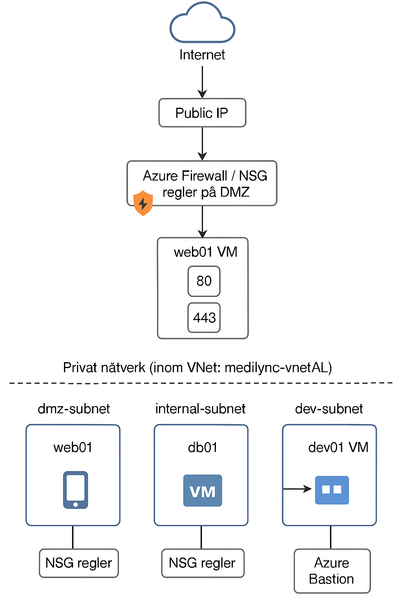

# Secure Cloud Solution – Medilync AB

## 📚 Innehållsförteckning

- [Infrastrukturöversikt](#infrastrukturöversikt)
- [Säkerhet](#säkerhet)
- [Backup och återställning](#backup-och-återställning)
- [Diskkryptering](#diskkryptering)
- [Lärdomar](#lärdomar)
- [Dokumentation](#dokumentation)
- [Arkitekturdiagram](#arkitekturdiagram)

Detta projekt simulerar en säker molninfrastruktur i Microsoft Azure för ett vårdbolag, Medilync AB. Lösningen omfattar flera säkerhets- och nätverksfunktioner inklusive:

## 🔐 Infrastrukturöversikt

- **Virtuella nätverk (VNet)**
  - medilync-vnetAL med tre undernät:
    - `dmz-subnet`
    - `internal-subnet`
    - `dev-subnet`

- **Virtuella maskiner**
  - `web01` (DMZ, public IP)
  - `db01` (Internal, ingen public IP)
  - `dev01` (Dev, ingen public IP, ansluts via Azure Bastion)

- **Nätverkssäkerhetsgrupper (NSG)**
  - Separata NSG:er för varje subnet med begränsade regler

- **Säker åtkomst**
  - Användning av SSH-nyckelautentisering
  - Azure Bastion för säker intern åtkomst

## 👤 Identitet och åtkomst (IAM)

- Roller tilldelades i två olika resursgrupper:
  - `Medilync-ProdRG`: Läsare
  - `Medilync-DevRG`: Deltagare och Virtuell datordeltagare för Developer User

- Följande användare skapades:
  - `Admin User` (tillfälligt ägare)
  - `Developer User`
  - `Finance User`
  - `Nurse User`

- **Patientrollen** har beaktats ur ett säkerhets- och åtkomstperspektiv.
  - Hanteras externt via frontend/B2C eller API-autentisering
  - Ingen användare skapades i Entra ID, men rollen finns definierad i designen

## 🔒 Säkerhet

- Azure Defender for Cloud aktiverades (och senare inaktiverades för kostnadskontroll)
- Säkerhetskopiering testades för `web01` (Backup via Recovery Services vault)
- VM Insights aktiverades tillfälligt för övervakning
- Monitor och Log Analytics anslutna till `web01`

## 💾 Backup och återställning

- Backup aktiverades och verifierades via återställningspunkter
- Säkerhetskopieringen togs därefter bort för att minska kostnader

## 🔑 Diskkryptering

- CMK (Customer Managed Key) användes för att kryptera `web01_OsDisk`
- Nyckelhantering skedde via Key Vault: `medilync-cmkvault`
- Nyckel: `web01-des`

## 🧠 Lärdomar

Projektet visar hur man bygger en säker och segmenterad molnmiljö i Azure med fokus på:
- IAM
- Nätverkssäkerhet
- Kryptering
- Backup och övervakning

## 📁 Dokumentation

- Projektfiler, PDF:er och skärmdumpar lagras i projektets GitHub-repo.

## 📊 Arkitekturdiagram

Här ser du en visuell översikt av infrastrukturen:

<em>Diagram 1: Översikt av den säkra Azure-infrastrukturen</em>

